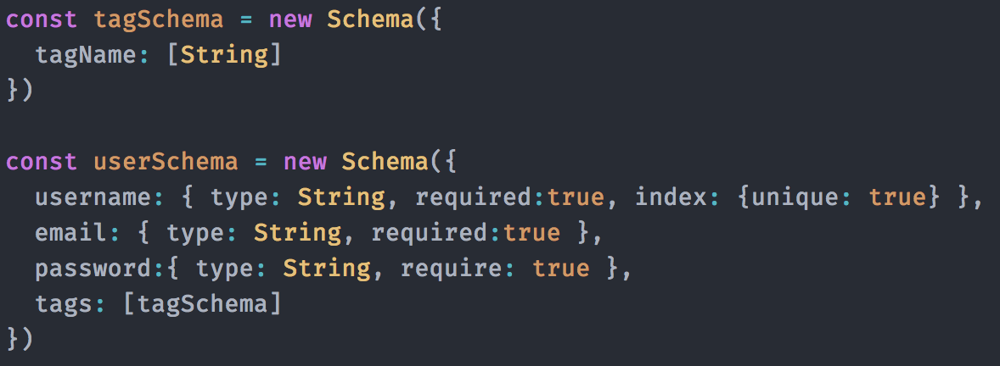

# Real-time-web-project
The `#`finder. With this app you can search on hashtags.  
New twitter posts will be send realtime to the client.  

# Table of Content
- [Getting started](#getting-started)
- [Features](#features)
- [Used technology](#used-technology)
- [External datasource](#external-data-source)
- [Database](#database-system)
- [Checklist](#checklist)
- [License](#license)


# Getting Started
How to get started with this project:

1. Clone the repo with `git clone https://github.com/Sam-Guliker/real-time-web-project` or download it from github
2. Run `npm install` or `yarn` to install the dependencies
3. Run `npm start` to start the server
4. Go to [http://localhost:3000/](http://localhost:3000/)

# Features
The following is possible with this application:
- Register as an user
- Searching for tweets that got some kind of hashtag in it.
- Saving twitter hashtags

# External data source
I'm using the twitter-stream-api to get the data flow going.
[twitter-stream-api](https://www.npmjs.com/package/twitter-stream-api)

Server-side:
```
io.on('connection', function(socket) {
  socket.on('search', function(data) {
    var trackedData = data
    Twitter.stream('statuses/filter', {
          track: trackedData,
          stall_warnings: true
      })
    })
})
```

Client-side:
```
(function (){
    var socket = io()

    var app = {

        search: function() {
            const input = document.getElementsByName('hashtag')[0]
            const button = document.getElementsByName('button')[0]

            input.addEventListener('keyup', function() {
                const userValue = this.value
            })

            button.addEventListener('click', function() {
                const userValue = input.value
                socket.emit('search',userValue)
            })
        }
    }

    app.search()

})();
```

# Database system
I'm using [mongoDB](https://www.mongodb.com/) to save user data.

set-up:



# Checklist
`This` contains what I've done for this project and what I still have to do.
- [x] MongoDB set-up
- [x] Schema set-up
- [x] Register
- [x] Connection with the twitter-stream-api
- [x] User input connects with the twitter-stream-api
- [ ] Saving data in an array
 filter it out
- [ ] show the tweets on screen.
- [ ] adding ID's to sockets.


# License

<!-- Add a nice image here at the end of the week, showing off your shiny frontend 📸 -->

<!-- Maybe a table of contents here? 📚 -->

<!-- How about a section that describes how to install this project? 🤓 -->

<!-- ...but how does one use this project? What are its features 🤔 -->

<!-- What external data source is featured in your project and what are its properties 🌠 -->

<!-- Where do the 0️⃣s and 1️⃣s live in your project? What db system are you using?-->

<!-- Maybe a checklist of done stuff and stuff still on your wishlist? ✅ -->

<!-- How about a license here? 📜 (or is it a licence?) 🤷 -->
