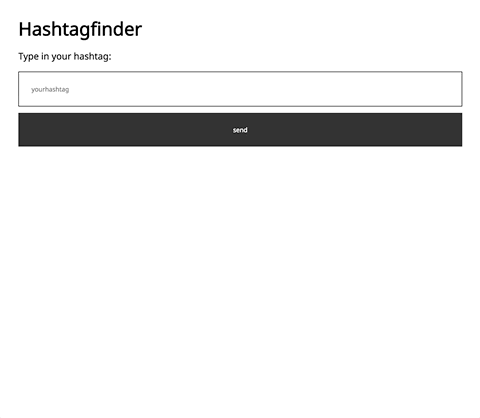
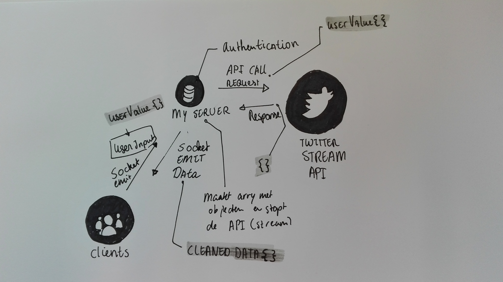

# Real-time-web-project

The `#`finder. With this app you can search on hashtags.  
New twitter posts will be send realtime to the client.

[The App](https://hashtagfind.herokuapp.com/)  


# Table of Content

* [Getting started](#getting-started)
* [Features](#features)
* [Data life cycle](#data-life-cycle)
* [External datasource](#external-data-source)
* [Checklist](#checklist)
* [Wishlist](#wishlist)
* [License](#license)

# Getting Started

How to get started with this project:

1.  Clone the repo with `git clone https://github.com/Sam-Guliker/real-time-web-project` or download it from github
2.  Run `npm install` or `yarn` to install the dependencies
3.  Run `npm start` to start the server
4.  Go to [http://localhost:3001/](http://localhost:3001/)

# Features

You can search on hashtags , and you'll get tweets in!

# Data life cycle 


# External data source

I'm using the twitter-stream-api to get the data flow going.
[twitter-stream-api](https://www.npmjs.com/package/twitter-stream-api)

Server-side:

```
io.on("connection", function(socket) {
  var trackedData;

  socket.on("search", function(data) {
    console.log("On search");
    var dataArray = [];

    trackedData = data;

    Twitter.stream("statuses/filter", {
      track: trackedData,
      stall_warnings: true
    });

    Twitter.on("data", function(obj) {
      console.log("Got data", dataArray.length);

      var cleanedData = {
        id: obj.id,
        username: obj.user.screen_name,
        afbeelding: obj.user.profile_image_url,
        text: obj.text
      };

      dataArray.push(cleanedData);

      socket.emit("create", dataArray[dataArray.length - 1]);

      var filtered = dataArray.filter(function(item) {
        return item.id === cleanedData;
      });

      if (filtered.length > 1) {
        dataArray.pop();
      }

      if (dataArray.length === 10) {
        console.log("Done");
        Twitter.close(); // Stop the function from running any further
        return; //
      }
    });

    socket.emit(dataArray);
  });
});
```

Client-side:

```
(function() {
  var socket = io();

  var app = {
    search: function() {
      const input = document.getElementsByName("hashtag")[0];
      const button = document.getElementsByName("button")[0];
      console.log(button);

      input.addEventListener("keyup", function() {
        const userValue = this.value;
      });

      button.addEventListener("click", function() {
        const userValue = input.value;
        socket.emit("search", userValue);
      });
    },
    create: function(cleanedData) {
      const main = document.querySelector("main");

      const article = document.createElement("article");
      const section = document.createElement("section");
      const h2 = document.createElement("h2");
      const p = document.createElement("p");
      const img = document.createElement("img");

      main.append(article);
      article.append(section);
      section.append(h2);
      section.append(img);
      article.append(p);

      h2.textContent = cleanedData.username;
      img.src = cleanedData.afbeelding;
      p.textContent = cleanedData.text;
    }
  };

  socket.on("search", function(data) {});
  socket.on("create", app.create);
  app.search();
})();
```

<!--
# Database system

I'm using [mongoDB](https://www.mongodb.com/) to save user data.

set-up:

 -->

# Checklist

`This` contains what I've done for this project and what I still have to do.

- [x] Connection with the twitter-stream-api
- [x] User input connects with the twitter-stream-api
- [x] Creates elements for the user
- [ ] What happens when being offline

# Wishlist
Things I wish to add :eyes:

- [x] MongoDB set-up
- [x] Schema set-up
- [ ] Save favorite tweets
- [ ] Register
- [ ] Load more button that connects with the socket.

# Lisence
Copyright © 2018 Sam Guliker.  
Released under the [MIT license](https://opensource.org/licenses/MIT)